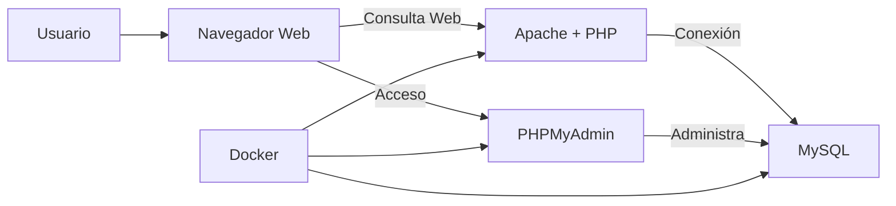

>Antes de empezar asumo que ya tienes docker instalado y docker compose sino es asi instalalo para que puedas seguir :)
# Docker LAMP

>**Docker** es una plataforma que permite crear, implementar y ejecutar aplicaciones en contenedores. Los contenedores son entornos ligeros y portátiles que incluyen todo lo necesario para ejecutar una aplicación, desde el código hasta las bibliotecas y configuraciones.

## ¿Qué es LAMP?

**LAMP** es un acrónimo que se refiere a una pila de tecnologías utilizadas para desarrollar aplicaciones web. Estas tecnologías son (L-A-M-P):
- **Linux**: El sistema operativo.
- **Apache**: El servidor web.
- **MySQL**: El sistema de gestión de bases de datos.
- **PHP**: El lenguaje de programación utilizado para el desarrollo web.

Usar Docker para implementar LAMP facilita la gestión y escalabilidad de aplicaciones web al permitir que cada componente se ejecute en un contenedor independiente, lo que brinda flexibilidad y mejora la portabilidad que es por lo que muchos lo usan :p .
> Este modelo representa la arquitectura de los servicios corriendo en contenedores Docker.

## Usando Docker Compose

**Docker Compose** es una herramienta que permite definir y ejecutar aplicaciones con múltiples contenedores usando un archivo YAML. Esto simplifica la configuración y ejecución de aplicaciones que requieren varios servicios (por ejemplo, una aplicación LAMP).

### Pasos para descargar y levantar :)

Clona mi repositorio:

```bash
git clone https://github.com/Hes01/Infraestructura-LAM-con-Docker-Compose.git
```

Luego, navega a la carpeta clonada y ejecuta el siguiente comando para iniciar los contenedores:

```bash
docker-compose up -d
```

- Abre **phpMyAdmin** en [http://127.0.0.1:8000](http://127.0.0.1:8000).
- Abre un navegador para ver tu aplicación PHP en [http://127.0.0.1:8080](http://127.0.0.1:8080).

Si deseas clonar tu proyecto en `www/`, accede a tu aplicación en [http://127.0.0.1/YourProject](http://127.0.0.1/YourProject).

Para acceder al cliente MySQL, ejecuta:

```bash
docker-compose exec db mysql -u root -p
```

> Y ulala :) ya tienes todo bueno ahora viene une explicadita por si quieres cambiar algo, en caso que tengas problemas puede que sean los puertos o la versión de php por ejemplo caso sea asi debes ver la versión que quieras.

### Dockerfile

El Dockerfile define cómo se construye la imagen del contenedor para PHP y Apache.

```dockerfile
FROM php:8.0.0-apache  # Imagen base de PHP 8.0 con Apache
ARG DEBIAN_FRONTEND=noninteractive  # Evitar interacción durante la instalación

# Instalar extensiones necesarias para PHP y MySQL
RUN docker-php-ext-install mysqli zip mbstring gd

# Actualizar repositorios y limpiar archivos temporales
RUN apt-get update && apt-get install -y sendmail libpng-dev \
    libzip-dev zlib1g-dev libonig-dev && \
    rm -rf /var/lib/apt/lists/*
```

### Explicación del Dockerfile

1. **FROM php:8.0.0-apache**: Define la imagen base de PHP 8.0 con Apache.
2. **RUN docker-php-ext-install**: Instala extensiones necesarias como `mysqli`, `zip`, `mbstring` y `gd` para manejar bases de datos, compresión de archivos y manipulación de imágenes.
3. **RUN apt-get update**: Actualiza los repositorios e instala dependencias adicionales.

---

### docker-compose.yml

Este archivo define cómo se conectan y configuran los diferentes servicios que componen la infraestructura LAMP.

```yaml
services:
  db:
    image: mysql:8.0
    ports:
      - "3306:3306"
    environment:
      MYSQL_DATABASE: dbname
      MYSQL_USER: root
      MYSQL_PASSWORD: test
      MYSQL_ROOT_PASSWORD: test
    volumes:
      - ./dump:/docker-entrypoint-initdb.d
      - ./conf:/etc/mysql/conf.d
      - persistent:/var/lib/mysql
    networks:
      - default

  www:
    build: .
    ports:
      - "8080:80"
    volumes:
      - ./www:/var/www/html
    links:
      - db
    networks:
      - default

  phpmyadmin:
    image: phpmyadmin/phpmyadmin
    links:
      - db:db
    ports:
      - "8000:80"
    environment:
      PMA_HOST: db
      PMA_USER: root
      PMA_PASSWORD: test
      MYSQL_ROOT_PASSWORD: test

volumes:
  persistent:
```

### Explicación del docker-compose.yml

1. **db**: Define el contenedor MySQL.
   - **image**: Utiliza la imagen de MySQL 8.0.
   - **ports**: Mapea el puerto 3306 para MySQL.
   - **volumes**: Define un volumen para la persistencia de los datos.
   
2. **www**: Define el contenedor para la aplicación PHP con Apache.
   - **build**: Construye el contenedor utilizando el `Dockerfile`.
   - **ports**: Mapea el puerto 8080 para acceder a la aplicación.
   - **volumes**: Sincroniza la carpeta `www` con el contenedor para servir los archivos.

3. **phpmyadmin**: Define el contenedor de phpMyAdmin.
   - **ports**: Mapea el puerto 8000 para acceder a la interfaz de phpMyAdmin.

4. **volumes**: Define el volumen persistente que garantiza que los datos de MySQL se mantengan.

---

> Este proyecto te permitirá desplegar una infraestructura completa LAMP con docker facilito :) .
